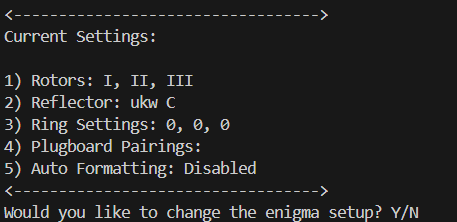
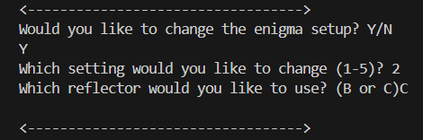
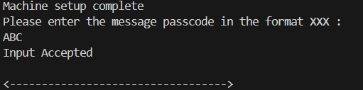
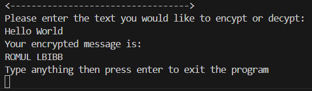

# Overview
This program simulates an Enigma machine. The Enigma machine was the device responsible for encoding the majority of encrypted communication between different parts of the German Army during World War Two. Breaking the encryption of this machine was the work of Bletchey Park and famously Alan Turing. Their work laid much of the foundations for the construction of the first computers in the late 1940's.

This machine simulates an Enigma M3 which was the variation of enigma that was used by the German Army and Air Force for the majority of the war. The program uses a command line interface and allows the user to change the machine's setup and encrypt and decrypt messages in the same way that a real Enigma M3 would.

# How to install
* First, head to https://github.com/Thesupernile/Enigma-Simulator/releases/tag/Release or the releases section of this repository
* Next, click the hyperlink labeled EnigmaSim.exe under the assets tab and allow the download
* Finally, double click the file EnigmaSim in your downloads and enjoy

* A common issue encountered is firewall blocking the application being run. On windows, first click more info and then click allow program to run anyway

# Instructions for use

## Setup
The machine will intially ask if you would like a review of these instructions, if you would, type Y, if you would not, type N
After you have passed this menu, you will be presented with the current setup of the enigma machine and the option to change it or to keep it the same.
If you want your messages to be even remotely secure, you will want to change this setup

### Rotor Choice
By default the rotors in the enigma machine are set to I, II and III. To alter which rotors you would like to use, select setting 1 by typing 1 when prompted.
Changing the rotors, or changing the order of the rotors, will change the way the machine encrypts the message you input. 
The program will prompt you to select a series of three rotors. While the program will allow you to use three instances of the same rotor, (included for those that are curious on what effect it would have), if you want your encryption to be historically accurate, you should use only one of each rotors I, II, III, IV and V

### Reflector
The reflector will swap one letter for another after the first pass through of the rotors. 
Changing the reflector also changes the final result of the encryption. You have two choices of reflector, UKW B or UKW C
To select the reflector you would like to chose, select setting 2 when prompted and then type either B or C to select the respective reflector

### Ring Setting
The ring setting is an offset applied to the message passcode (more on that later) which again, will change the result of the final message encryption. Each is a number between 0 and 25. 
In the real enigma machine, this translates to the letter ring being pinned under the A (0) to the ring being pinned under Z (25). 
To change this, type 3 when prompted for a setting choice and type the three ring settings
If a number greater than 25 is entered, the program will modulo it, (so if you type 26, you will get 0. or if you type 543, you would get 23)

### Plugboard Pairings
The plugboard swaps a pair of letters before they are encrypted and again once they are done encrypting your message
**WARNING:** Chosing to edit the plugboard will automatically delete any pairings currently stored
The program will ask you to continue entering pairings in the format of two letters until you reach ten pairings or type exit
The order of the letters in the pair does not matter (FT if the same as TF). The program will not allow you input more than one pairing containing the same letter as this is impossible in the real enigma machine

### Auto Formatting
Auto formatting does not affect encryption. In the German army, it was standard practice to write messages in groups of five letters, regardless of the spaces between words. By default this is enabled, but it can be disabled by typing 5 when propted for a setting to change and then typing N. Reenable it by going through the same process and typing Y.

The intended recipient of your encrypted message **MUST** know this information to decode your message

## Message passcodes
Once you have completed the enigma setup, you will prompted for a message passcode. This is a series of three letters that tells the program what position you would like the rotor wheels to start on. This must be different for each message and **MUST** also be known by the intended recipient to allow the message to be decoded. An example message passcode would be CFE or LON.

## Encryption and Decryption
Finally the program will ask you what text you would to encrypt. Type the message you want to encrypt and press enter. The program will tell you the encrypted text

To decrypt, simply follow the same process, set your machine up in exactly the same way the sender set their machine up and enter the encrypted text. This will decode the text and allow you to read it.

If the machine does not return the intended text, double check the machine is set up correctly.

# Screenshots

Settings Menu:

Changing the reflector:

Inputting a message passcode:

Encrypting the message:

